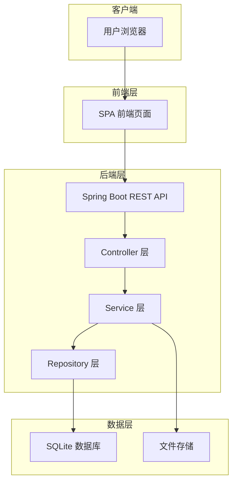
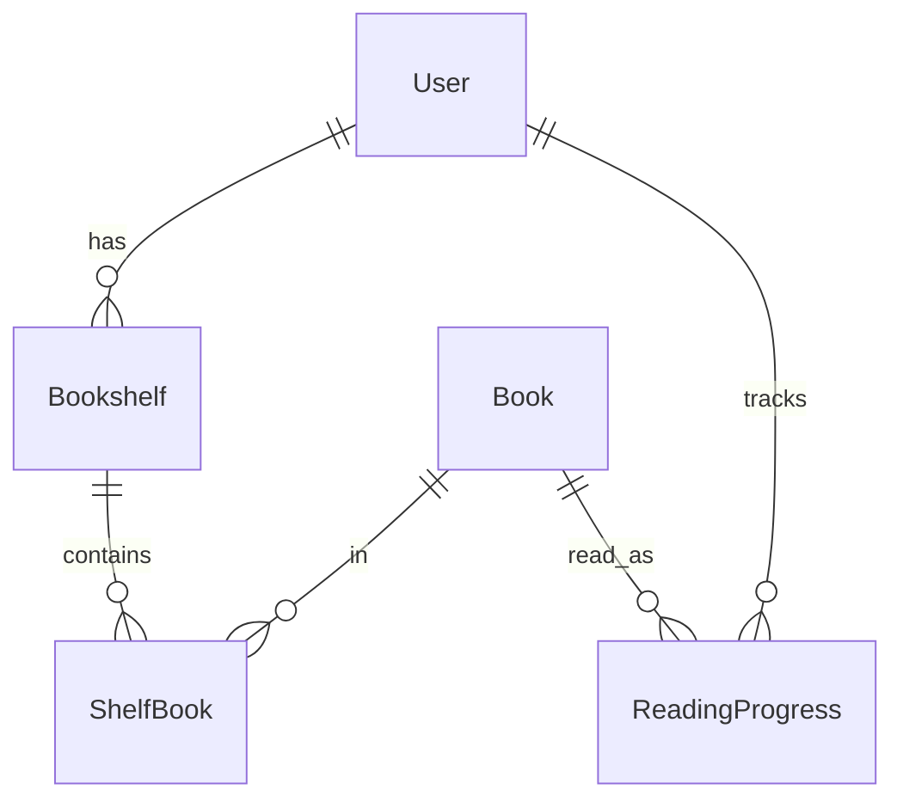
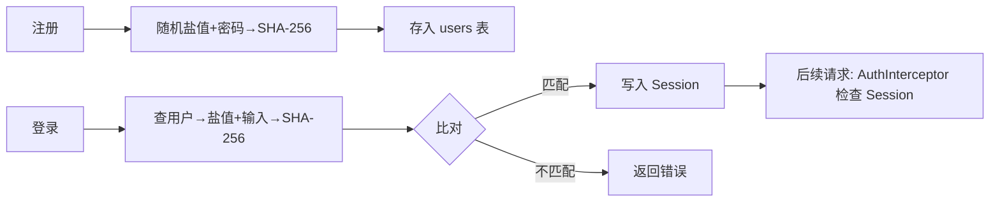
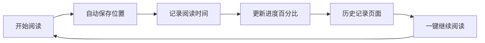
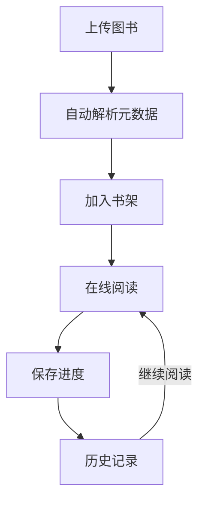
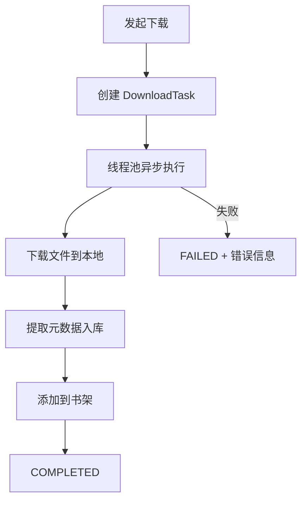

# Webrary 个人数字图书馆系统

## 基于 Web 的个人数字书房

<div class="pt-12">
  <span class="text-neutral-400">Spring Boot · SQLite · EPUB.js · Docker</span>
</div>

<div class="pt-8 text-sm opacity-50">
  小组展示 · 四人轮流讲解
</div>

---

layout: center
---

# 模块划分

<div class="grid grid-cols-2 gap-8 pt-8">

<div class="border-2 border-blue-400/30 rounded-xl p-6 text-center">
  <div class="text-blue-400 text-lg font-bold">Module 1</div>
  <div class="text-2xl font-bold pt-2">webrary-common</div>
  <div class="text-sm text-gray-400 pt-2">公共基础<br/>成员A 演示</div>
  <div class="text-xs text-gray-500 pt-1">entities, repos, DTOs, config</div>
</div>

<div class="border-2 border-green-400/30 rounded-xl p-6 text-center">
  <div class="text-green-400 text-lg font-bold">Module 2</div>
  <div class="text-2xl font-bold pt-2">webrary-auth</div>
  <div class="text-sm text-gray-400 pt-2">用户认证<br/>成员B 演示</div>
  <div class="text-xs text-gray-500 pt-1">AuthController, AuthService</div>
</div>

<div class="border-2 border-yellow-400/30 rounded-xl p-6 text-center">
  <div class="text-yellow-400 text-lg font-bold">Module 3</div>
  <div class="text-2xl font-bold pt-2">webrary-biz</div>
  <div class="text-sm text-gray-400 pt-2">核心业务<br/>成员C 演示</div>
  <div class="text-xs text-gray-500 pt-1">书架+图书管理+阅读器+前端</div>
</div>

<div class="border-2 border-purple-400/30 rounded-xl p-6 text-center">
  <div class="text-purple-400 text-lg font-bold">Module 4</div>
  <div class="text-2xl font-bold pt-2">webrary-zlibrary</div>
  <div class="text-sm text-gray-400 pt-2">Z-Library 集成<br/>成员D 演示</div>
  <div class="text-xs text-gray-500 pt-1">ZlibraryController, ApiClient</div>
</div>

</div>

---
layout: section
---

# 模块一
## webrary-common — 公共基础

<div class="opacity-50 text-sm pt-4">演示人：成员A</div>

---

# 1.1 项目概述

Webrary 是一个基于 **Web 技术** 构建的个人数字图书馆系统。

<v-clicks>

- 📂 集中管理个人电子书资源（EPUB / PDF）
- 🌐 浏览器端在线阅读，无需安装客户端
- 🔍 自动解析电子书元数据（书名、作者、封面、目录）
- 📍 阅读进度自动保存，跨设备同步
- 📚 个人书架管理 + Z-Library 在线资源
- 🐳 Docker 一键部署，轻量化运行

</v-clicks>

---

# 1.2 系统技术架构

<div class="grid grid-cols-2 gap-8">

<div>

### 后端技术栈

<v-clicks>

- ☕ Java 17 + Spring Boot 3.5
- 🗄️ Spring Data JPA + Hibernate
- 🪶 SQLite 嵌入式数据库
- 📄 Apache PDFBox（PDF渲染）
- 🐳 Docker 多阶段构建

</v-clicks>

</div>

<div>

### 前端技术栈

<v-clicks>

- 🌐 HTML5 + CSS3
- 📜 Vanilla JavaScript SPA
- 📖 epub.js + Foliate.js
- 🎨 自定义暗色主题

</v-clicks>

</div>

</div>

---

# 1.3 系统架构设计

<div class="text-center pt-4">



</div>

---

# 三层架构职责

| 层级 | 组件 | 职责 |
|------|------|------|
| **Controller** | BookController · AuthController · BookshelfController · ZlibraryController | HTTP 请求、参数校验、JSON 响应 |
| **Service** | BookService · AuthService · DownloadService · EbookParserService · ZlibraryService | 业务逻辑、格式解析、下载调度 |
| **Repository** | BookRepository · ShelfBookRepository · UserRepository · ReadingProgressRepository | JPA 持久化、自定义 JPQL |
| **Model** | Book · Bookshelf · ShelfBook · User · ReadingProgress | 实体映射 |

---

# 1.4 数据库设计

<div class="grid grid-cols-2 gap-8">

<div>



</div>

<div class="text-sm">

| 表名 | 说明 |
|------|------|
| users | 用户表 (email, password_hash, salt) |
| books | 图书表 (title, author, file_path) |
| bookshelves | 书架表 (name, sort_order) |
| shelf_books | 关联表 (shelf_id, book_id) UNIQUE |
| reading_progress | 进度表 (current_page, finished) |
| user_zlibrary | Z-Library 配置 |

</div>

</div>

---

# 1.5 轻量化部署

<div class="grid grid-cols-3 gap-6 pt-8">

<div class="border rounded p-4 text-center">
  <div class="text-3xl mb-2">🪶</div>
  <div class="font-bold">SQLite</div>
  <div class="text-xs text-gray-400 pt-1">零配置 · 单文件 · 备份简单</div>
</div>

<div class="border rounded p-4 text-center">
  <div class="text-3xl mb-2">🐳</div>
  <div class="font-bold">Docker</div>
  <div class="text-xs text-gray-400 pt-1">Alpine JRE ~150MB</div>
</div>

<div class="border rounded p-4 text-center">
  <div class="text-3xl mb-2">☁️</div>
  <div class="font-bold">多场景</div>
  <div class="text-xs text-gray-400 pt-1">PC · NAS · VPS</div>
</div>

</div>

```bash
docker run -d -p 8080:8080 -v ./data:/app/data 20off/webrary:1.1
```

---
layout: section
---

# 模块二
## webrary-auth — 用户认证

<div class="opacity-50 text-sm pt-4">演示人：成员B</div>

---

# 2.1 用户认证系统

<div class="grid grid-cols-2 gap-8 pt-4">

<div>

### 功能特性

<v-clicks>

- 用户注册（邮箱 + 密码）
- 用户登录 / 登出
- Session 会话管理
- 用户数据隔离
- 登录状态持久化

</v-clicks>

</div>

<div>

### 安全实现

<v-clicks>

- 随机 16 字节盐值
- SHA-256 哈希
- 存储格式：`salt:hash`
- 拦截器统一校验
- 未登录返回 401

</v-clicks>

</div>

</div>

---

# 2.2 认证拦截器

```java
public class AuthInterceptor implements HandlerInterceptor {
    public boolean preHandle(HttpServletRequest request, ...) {
        // 1. 放行登录 / 注册接口
        if (isAuthApi(request.getRequestURI()))
            return true;
        // 2. 放行静态资源（CSS/JS/图片）
        if (isStaticResource(request.getRequestURI()))
            return true;
        // 3. 校验 Session 中的用户信息
        if (session.getAttribute("user") != null)
            return true;
        // 4. 未登录 → 返回 401
        response.setStatus(401);
        return false;
    }
}
```

---

# 2.3 认证流程



---

### AuthController API

| 端点 | 方法 | 说明 |
|------|------|------|
| `/api/auth/register` | POST | 用户注册 |
| `/api/auth/login` | POST | 用户登录 |
| `/api/auth/logout` | POST | 用户登出 |
| `/api/auth/me` | GET | 获取当前用户信息 |

---
layout: section
---

# 模块三
## webrary-biz — 核心业务

<div class="opacity-50 text-sm pt-4">演示人：成员C</div>

---

# 3.1 电子书管理系统

<div class="grid grid-cols-2 gap-8">

<div>

### 上传 & 解析

<v-clicks>

- 支持 EPUB / PDF 上传
- 自动保存文件到服务器
- EbookParserService 自动解析
- 提取：书名、作者、封面、目录
- 生成图书记录入库

</v-clicks>

</div>

<div>

### 图书管理

<v-clicks>

- 查看个人全部书籍
- 按书架分类浏览
- 搜索图书
- 右键菜单快捷操作
- 删除（可同时删文件）
- 书架间迁移

</v-clicks>

</div>

</div>

---

# 解析引擎核心逻辑

```java
public EbookMetadata parse(Path filePath) {
    String ext = getExtension(filePath);
    return switch (ext) {
        case "epub" -> parseEpub(filePath);  // ZIP→NCX/XHTML
        case "pdf"  -> parsePdf(filePath);   // PDFBox提取
        case "txt"  -> parseTxt(filePath);   // 编码检测+章节正则
        default     -> throw new UnsupportedFormatException(ext);
    };
}
// 解析结果: 书名 / 作者 / 封面 / 目录 / 文件大小
```

---

# 3.2 在线电子书阅读器

<div class="grid grid-cols-2 gap-8">

<div>

### EPUB 阅读

- 基于 **epub.js** 渲染
- 章节自动解析
- 目录侧边栏导航
- 流畅翻页体验
- 进度实时记录

</div>

<div>

### PDF 阅读

- 服务端 **PDFBox** → PNG
- 单页 / 双页模式
- 适配宽度 / 高度
- **智能预加载**（0~10页）
- PDF 目录提取

</div>

</div>

<div class="text-center pt-6 text-gray-400">
  无需安装任何客户端 — 打开浏览器即可阅读
</div>

---

# 3.3 个人书架系统

<div class="grid grid-cols-2 gap-8">

<div>

### 书架管理

- 创建多个书架
- 自定义名称
- **拖拽排序**
- 重命名 / 删除
- 阅读进度统计

</div>

<div>

### 书籍管理

- 添加 / 移除
- **书架间拖拽迁移**
- 右键菜单：标记已读/未读
- 批量选择
- UNIQUE(shelf_id, book_id)

</div>

</div>

---

# 3.4 阅读历史与进度同步

<div class="pt-4">



</div>

<div class="text-center pt-6">

<div class="text-lg font-bold">「打开网页即可继续上次阅读」</div>

<v-clicks>

- 📍 位置自动记录 · 🔄 跨会话恢复 · 📊 历史时间线 · ⏯️ 一键接续

</v-clicks>

</div>

---

# 3.5 前端架构

**Vanilla JavaScript SPA** — 无框架依赖，轻量化单页应用

| 页面 | 文件 | 行数 | 说明 |
|------|------|------|------|
| 主页 | index.html + app.js | ~2800 | 书架网格、搜索、详情、上传弹窗 |
| 阅读器 | reader.html + reader.js | ~1050 | EPUB/PDF/TXT 阅读、目录、进度 |
| 样式 | style.css | — | 暗色主题设计系统 |

**自定义组件**：图书详情弹窗、上传弹窗、设置弹窗、右键菜单、下载队列

---

# 3.6 项目亮点 — 完整闭环



<div class="text-center pt-6">
  <v-clicks>

  📤 拖拽上传 · 🔍 秒级解析 · 📖 一键阅读 · 💾 无声保存 · 🔄 随时继续

  </v-clicks>
</div>

---
layout: section
---

# 模块四
## webrary-zlibrary — Z-Library 集成

<div class="opacity-50 text-sm pt-4">演示人：成员D</div>

---

# 4.1 Z-Library 资源整合

<div class="grid grid-cols-2 gap-8 pt-4">

<div>

### 在线能力

<v-clicks>

- 用户账号绑定
- 在线搜索书籍
- 热门书籍浏览
- 书籍详细信息
- 按格式 / 语言 / 年份筛选

</v-clicks>

</div>

<div>

### 下载管理

<v-clicks>

- 异步下载队列
- 实时进度追踪
- 下载完成自动入库
- 元数据自动提取
- 添加到指定书架

</v-clicks>

</div>

</div>

---

# 4.2 ZlibraryApiClient

```java
public class ZlibraryApiClient {
    // 登录 → 获取 JWT Token
    public boolean login(String email, String password);

    // 搜索书籍
    public SearchResult search(String query, String year,
                                String lang, String format);

    // 获取书籍详情
    public BookInfo getBookInfo(Long bookId, String hash);

    // 获取下载链接
    public String getDownloadUrl(Long bookId, String hash,
                                  String format);

    // 热门书籍
    public List<BookInfo> getPopular(int count);
}
```

---

# 4.3 API 端点 & 下载流程

<div class="grid grid-cols-2 gap-8">

<div>

| 端点 | 说明 |
|------|------|
| POST /login | 绑定账号 |
| POST /search | 在线搜索 |
| GET /book/{id} | 书籍详情 |
| POST /download | 异步下载 |
| GET /popular | 热门书籍 |
| GET /tasks | 下载列表 |

</div>

<div>



</div>

</div>

---

# 4.4 后续优化方向

<div class="grid grid-cols-2 gap-6 pt-8">

<div class="border rounded p-4">
  <div class="text-2xl mb-2">🤖</div>
  <div class="font-bold">AI 阅读助手</div>
  <div class="text-xs text-gray-400">章节总结 · 智能问答 · 生词解释</div>
</div>

<div class="border rounded p-4">
  <div class="text-2xl mb-2">👥</div>
  <div class="font-bold">多用户共享</div>
  <div class="text-xs text-gray-400">家庭书库 · 权限管理 · 评论讨论</div>
</div>

<div class="border rounded p-4">
  <div class="text-2xl mb-2">☁️</div>
  <div class="font-bold">云同步</div>
  <div class="text-xs text-gray-400">多设备同步 · 自动备份 · 数据统计</div>
</div>

<div class="border rounded p-4">
  <div class="text-2xl mb-2">📚</div>
  <div class="font-bold">更多格式</div>
  <div class="text-xs text-gray-400">MOBI · AZW3 · FB2 · DJVU</div>
</div>

</div>

---
layout: center
class: text-center
---

# 总结

<div class="pt-8 text-lg">

**Webrary** — 个人数字图书馆系统

<span class="text-blue-400">Spring Boot</span> +
<span class="text-green-400">SQLite</span> +
<span class="text-yellow-400">现代 Web 阅读技术</span>

</div>

<div class="pt-4 text-sm text-gray-400">
  电子书管理 · 在线阅读 · 书架系统 · 进度同步 · Z-Library 集成
</div>

<div class="pt-8">
  <a href="https://github.com/ffdkj/webrary" target="_blank" class="text-xl">
    github.com/ffdkj/webrary
  </a>
</div>

---

# 🎉 感谢观看

<div class="pt-4 text-gray-400 text-sm">
  Webrary — 你的个人数字书房
</div>
